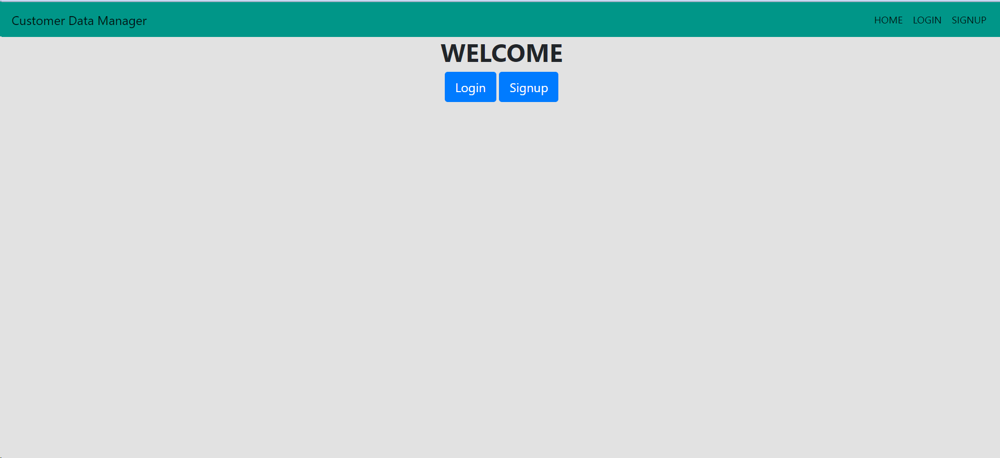
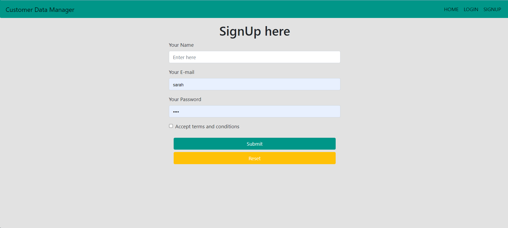
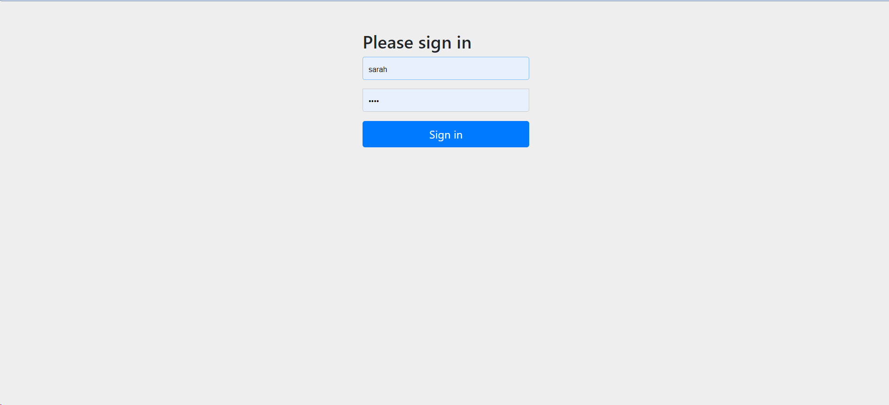
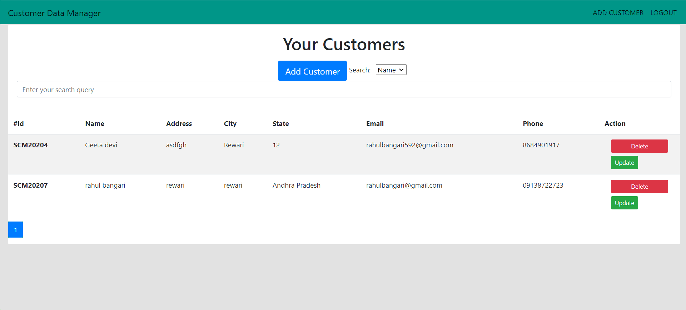
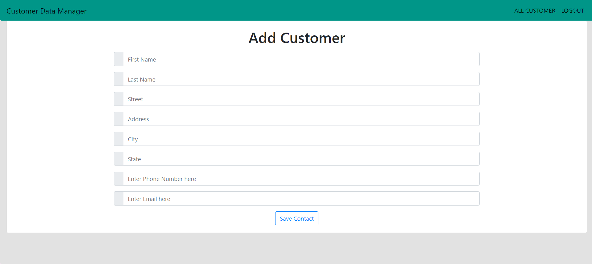
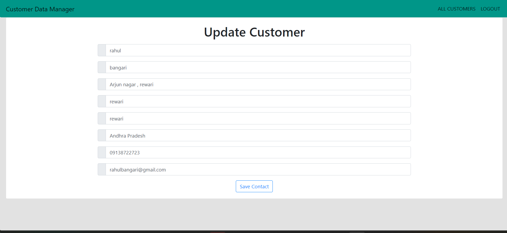

#Customer Manager

The main Objective of this project to create an application which stores customer in very efficient way and provides a smarter way of handling customer with fully Authentication and Authorization. We created this project using Spring Boot Thymeleaf with MVC Architecture and for Authentication and Authorization we have used Spring Security.

## Technologies Used

- **Spring Boot:** Framework for building Java-based enterprise applications.
- **Maven:** Build and project management tool.
- **Hibernate:** Object-relational mapping framework for Java.
- **SQL Database:** Database used for storing and retrieving data.
- **Spring Security:** Framework for securing Spring-based applications.
- **Thymeleaf:** Server-side Java template engine for web and standalone environments.
- **HTML, CSS, and JS:** Frontend technologies for building the user interface.

## Features

1. **User Authentication and Authorization:** Users can log in to the application with their credentials. Different users have access to their own set of customers.

2. **User Dashboard:** Provides a paginated view of the user's customers, allowing easy navigation.

3. **Add Customer:** Users can add new customer details, which are associated with their account.

4. **Update Customer:** Users can edit the details of an existing customer.

5. **Delete Customer:** Users can remove a customer from their list.

6. **Search Customers:** Allows users to search for customers based on name, email, phone, or city.

## API Endpoints

Here are the main API endpoints available in the project:

- **Home:**
    - http://localhost:8080/api/home

- **Signup:**
    - http://localhost:8080/api/signup

- **User DashBoard:**
    - http://localhost:8080/user/index/{cId}

- **Add Contact:**
    - http://localhost:8080/user/add_contact

- **Update Customer:**
    - http://localhost:8080/user/update-customer/{cId}

- **Show Customer:**
    - http://localhost:8080/user/showCustomer/{cId}

- **Delete Customer:**
    - http://localhost:8080/user/delete/{cId}

- **Search:**
    - http://localhost:8080/search/{type}/{query}

##Preview

Home Page

Signup Page

Login Page

DashBoard Page

Add Customer Page

Update Customer Page

